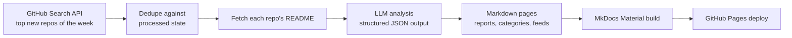

# 📡 Open Source Radar AI

**AI-curated radar of GitHub's hottest new repositories — analyzed, categorized, and published automatically every week.**

[](https://github.com/LokeshNanda/oss-radar-ai/actions/workflows/trending.yml)
[](LICENSE)
[](https://lokeshnanda.github.io/oss-radar-ai/)

👉 **Read this week's radar: [lokeshnanda.github.io/oss-radar-ai](https://lokeshnanda.github.io/oss-radar-ai/)**
📶 Subscribe: [RSS feed](https://lokeshnanda.github.io/oss-radar-ai/feed.xml) · Build on it: [JSON API](https://lokeshnanda.github.io/oss-radar-ai/api/latest.json)

Every Monday, this project finds the most-starred repositories created on GitHub in the last 7 days, generates an honest developer-focused breakdown of each one with an LLM (what it does, why it's interesting, how it works, how to try it, what to watch out for), and publishes everything as a static site — with zero manual steps.

---

## 📡 This week's radar

<!-- RADAR:START -->
_Week of 2026-07-20_

- [`xai-org/grok-build`](https://github.com/xai-org/grok-build) ([analysis](https://lokeshnanda.github.io/oss-radar-ai/repos/xai-org--grok-build/))
- [`Fei-Away/Codex-Dream-Skin`](https://github.com/Fei-Away/Codex-Dream-Skin) ([analysis](https://lokeshnanda.github.io/oss-radar-ai/repos/fei-away--codex-dream-skin/))
- [`CluvexStudio/Aether`](https://github.com/CluvexStudio/Aether) ([analysis](https://lokeshnanda.github.io/oss-radar-ai/repos/cluvexstudio--aether/))
- [`pixel-point/aval`](https://github.com/pixel-point/aval) ([analysis](https://lokeshnanda.github.io/oss-radar-ai/repos/pixel-point--aval/))
- [`littledivy/mimic`](https://github.com/littledivy/mimic) ([analysis](https://lokeshnanda.github.io/oss-radar-ai/repos/littledivy--mimic/))
- [`tandpfun/wardrobe`](https://github.com/tandpfun/wardrobe) ([analysis](https://lokeshnanda.github.io/oss-radar-ai/repos/tandpfun--wardrobe/))
- [`oil-oil/beautify-github-readme`](https://github.com/oil-oil/beautify-github-readme) ([analysis](https://lokeshnanda.github.io/oss-radar-ai/repos/oil-oil--beautify-github-readme/))
- [`nethical6/conversation-steganography`](https://github.com/nethical6/conversation-steganography) ([analysis](https://lokeshnanda.github.io/oss-radar-ai/repos/nethical6--conversation-steganography/))
- [`pablostanley/yoinks`](https://github.com/pablostanley/yoinks) ([analysis](https://lokeshnanda.github.io/oss-radar-ai/repos/pablostanley--yoinks/))
- [`KubeezMedia/kubeez-scroll-world-video`](https://github.com/KubeezMedia/kubeez-scroll-world-video) ([analysis](https://lokeshnanda.github.io/oss-radar-ai/repos/kubeezmedia--kubeez-scroll-world-video/))
<!-- RADAR:END -->

---

## ⚙️ How it works



Everything runs in a single scheduled GitHub Actions workflow ([`trending.yml`](.github/workflows/trending.yml)). Generated pages and state are committed back to the repo, so every run is reproducible and diffable.

## ✨ Features

- **Weekly radar reports** — the top 10 new repositories, ranked by stars
- **Developer-focused AI analysis** — grounded in each repo's README, honest about uncertainty, no hype
- **Deterministic & idempotent** — same inputs produce byte-identical output; repos are never analyzed twice
- **Fully automated** — fetch → analyze → publish with no human in the loop
- **Cheap to run** — roughly $0.05/week with `gpt-4o-mini`

## 🍴 Run your own radar

This project is designed to be forked. Point it at your favorite niche — a **Rust radar**, an **AI-agents radar**, a **security radar** — by changing a couple of environment variables, adding an API key, and enabling GitHub Pages. Follow the [10-minute setup guide](https://lokeshnanda.github.io/oss-radar-ai/run-your-own/).

## 🚀 Local development

```bash
python -m venv .venv
source .venv/bin/activate   # Windows: .venv\Scripts\activate
pip install -e ".[dev]"

# run the test suite
python -m pytest tests -q

# run the pipeline (needs OPENAI_API_KEY, optional GITHUB_TOKEN)
cp .env.example .env        # then fill in your keys
radar-run

# preview the site
mkdocs serve
```

### Configuration

| Variable | Default | Purpose |
| --- | --- | --- |
| `OPENAI_API_KEY` | — | Required. LLM API key |
| `OPENAI_MODEL` | `gpt-4o-mini` | Model used for analysis |
| `OPENAI_BASE_URL` | `https://api.openai.com` | Any OpenAI-compatible endpoint |
| `GITHUB_TOKEN` | — | Optional. Raises GitHub API rate limits |
| `GITHUB_PER_PAGE` | `10` | Repos fetched per run |
| `GITHUB_DAYS_BACK` | `7` | Lookback window in days |
| `RADAR_MAX_REPOS_PER_RUN` | `10` | Cap on repos analyzed per run |

## 🗺 Roadmap

See [ROADMAP.md](ROADMAP.md) and the [design spec](specs/2026-07-24-popularity-roadmap-design.md).

## 📄 License

[MIT](LICENSE)
