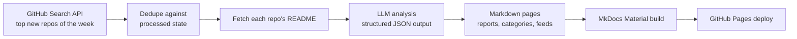

# 📡 Open Source Radar AI

**AI-curated radar of GitHub's hottest new repositories — analyzed, categorized, and published automatically every week.**

[](https://github.com/LokeshNanda/oss-radar-ai/actions/workflows/trending.yml)
[](LICENSE)
[](https://lokeshnanda.github.io/oss-radar-ai/)

👉 **Read this week's radar: [lokeshnanda.github.io/oss-radar-ai](https://lokeshnanda.github.io/oss-radar-ai/)**
📶 Subscribe: [RSS feed](https://lokeshnanda.github.io/oss-radar-ai/feed.xml) · Build on it: [JSON API](https://lokeshnanda.github.io/oss-radar-ai/api/latest.json)

Every Monday, this project finds the most-starred repositories created on GitHub in the last 7 days, generates an honest developer-focused breakdown of each one with an LLM (what it does, why it's interesting, how it works, how to try it, what to watch out for), and publishes everything as a static site — with zero manual steps.

---

## 📡 This week's radar

<!-- RADAR:START -->
_Week of 2026-08-31_

- [`sapientinc/PRAXIST`](https://github.com/sapientinc/PRAXIST) — Autonomous research system for measurable, computer-executable research. ([analysis](https://lokeshnanda.github.io/oss-radar-ai/repos/sapientinc--praxist/))
- [`HEJustinSun/my-girlfriend-jingtian-latex`](https://github.com/HEJustinSun/my-girlfriend-jingtian-latex) ([analysis](https://lokeshnanda.github.io/oss-radar-ai/repos/hejustinsun--my-girlfriend-jingtian-latex/))
- [`XiaoDuoYa/codex-with-chatgpt`](https://github.com/XiaoDuoYa/codex-with-chatgpt) — ChatGPT thinks. Codex works. Use ChatGPT as the planning brain while keeping the Codex harness. ([analysis](https://lokeshnanda.github.io/oss-radar-ai/repos/xiaoduoya--codex-with-chatgpt/))
- [`Nanako0129/sepia`](https://github.com/Nanako0129/sepia) — De-AI writing skill for any Agent Skills-compatible agent (77+ via the Skills CLI), with native plugins for Claude Code, Codex, Grok Build, and Antigravity. Narrative-architecture repair for fiction, venue-matched rules for professional prose. Based on StoryScope (arXiv:2604.03136). ([analysis](https://lokeshnanda.github.io/oss-radar-ai/repos/nanako0129--sepia/))
- [`MetaMask-AI/metamask-desktop`](https://github.com/MetaMask-AI/metamask-desktop) — 🌐 🔌 The MetaMask desktop app enables browsing Ethereum blockchain enabled websites ([analysis](https://lokeshnanda.github.io/oss-radar-ai/repos/metamask-ai--metamask-desktop/))
- [`crmne/fastpotify`](https://github.com/crmne/fastpotify) — Spotify, native and fast. One lightweight Rust app for your whole library, local playback, and Spotify Connect on Linux, macOS, and Windows. ([analysis](https://lokeshnanda.github.io/oss-radar-ai/repos/crmne--fastpotify/))
- [`wide-trace/open-higgsfield`](https://github.com/wide-trace/open-higgsfield) — A studio for image and video generation — one prompt bar, each model’s own settings, and every finished run in one gallery. ([analysis](https://lokeshnanda.github.io/oss-radar-ai/repos/wide-trace--open-higgsfield/))
- [`kacperkapusciak/goldie`](https://github.com/kacperkapusciak/goldie) — ✨ agentic app store previews and screenshots ([analysis](https://lokeshnanda.github.io/oss-radar-ai/repos/kacperkapusciak--goldie/))
- [`amosblomqvist/learn`](https://github.com/amosblomqvist/learn) — My AI learning system. ([analysis](https://lokeshnanda.github.io/oss-radar-ai/repos/amosblomqvist--learn/))
- [`bryllim/workout-guide`](https://github.com/bryllim/workout-guide) — 302 open exercise illustrations and a framework-neutral npm package by Bryl Lim ([analysis](https://lokeshnanda.github.io/oss-radar-ai/repos/bryllim--workout-guide/))
<!-- RADAR:END -->

---

## ⚙️ How it works



Everything runs in a single scheduled GitHub Actions workflow. Generated pages and state are committed back to the repo, so every run is reproducible and diffable.

## ✨ Features

- **Weekly radar reports** — the top 10 new repositories, ranked by stars
- **Developer-focused AI analysis** — grounded in each repo's README, honest about uncertainty, no hype
- **Deterministic & idempotent** — same inputs produce byte-identical output; repos are never analyzed twice
- **Fully automated** — fetch → analyze → publish with no human in the loop
- **Cheap to run** — roughly $0.05/week with `gpt-4o-mini`

## 🍴 Run your own radar

This project is designed to be forked. Point it at your favorite niche — a **Rust radar**, an **AI-agents radar**, a **security radar** — by changing a couple of environment variables, adding an API key, and enabling GitHub Pages. Follow the [10-minute setup guide](https://lokeshnanda.github.io/oss-radar-ai/run-your-own/).

## 🚀 Local development

```bash
python -m venv .venv
source .venv/bin/activate   # Windows: .venv\Scripts\activate
pip install -e ".[dev]"

# run the test suite
python -m pytest tests -q

# run the pipeline (needs OPENAI_API_KEY, optional GITHUB_TOKEN)
cp .env.example .env        # then fill in your keys
radar-run

# preview the site
mkdocs serve
```

### Configuration

| Variable                  | Default                  | Purpose                                                                   |
| ------------------------- | ------------------------ | ------------------------------------------------------------------------- |
| `OPENAI_API_KEY`          | —                        | Required. LLM API key                                                     |
| `OPENAI_MODEL`            | `gpt-4o-mini`            | Model used for analysis                                                   |
| `OPENAI_BASE_URL`         | `https://api.openai.com` | Any OpenAI-compatible endpoint                                            |
| `GITHUB_TOKEN`            | —                        | Optional. Raises GitHub API rate limits                                   |
| `GITHUB_PER_PAGE`         | `10`                     | Repos fetched per run                                                     |
| `GITHUB_DAYS_BACK`        | `7`                      | Lookback window in days                                                   |
| `RADAR_MAX_REPOS_PER_RUN` | `10`                     | Cap on repos analyzed per run                                             |
| `RADAR_BLOCKLIST_TERMS`   | —                        | Extra comma-separated terms added to the built-in cheat/malware blocklist |
| `RADAR_BLOCKED_REPOS`     | —                        | Comma-separated `owner/name` repos to never feature                       |

## 🗺 Roadmap

See [ROADMAP.md](ROADMAP.md) and the [design spec](specs/2026-07-24-popularity-roadmap-design.md).

## 📄 License

[MIT](LICENSE)
