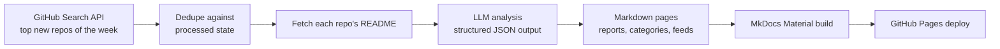

# 📡 Open Source Radar AI

**AI-curated radar of GitHub's hottest new repositories — analyzed, categorized, and published automatically every week.**

[](https://github.com/LokeshNanda/oss-radar-ai/actions/workflows/trending.yml)
[](LICENSE)
[](https://lokeshnanda.github.io/oss-radar-ai/)

👉 **Read this week's radar: [lokeshnanda.github.io/oss-radar-ai](https://lokeshnanda.github.io/oss-radar-ai/)**
📶 Subscribe: [RSS feed](https://lokeshnanda.github.io/oss-radar-ai/feed.xml) · Build on it: [JSON API](https://lokeshnanda.github.io/oss-radar-ai/api/latest.json)

Every Monday, this project finds the most-starred repositories created on GitHub in the last 7 days, generates an honest developer-focused breakdown of each one with an LLM (what it does, why it's interesting, how it works, how to try it, what to watch out for), and publishes everything as a static site — with zero manual steps.

---

## 📡 This week's radar

<!-- RADAR:START -->
_Week of 2026-08-18_

- [`deepseek-ai/deepseek-harness`](https://github.com/deepseek-ai/deepseek-harness) — DeepSeek Harness: Everything is a Plugin. ([analysis](https://lokeshnanda.github.io/oss-radar-ai/repos/deepseek-ai--deepseek-harness/))
- [`guillaumemeyer/watermarks-remover`](https://github.com/guillaumemeyer/watermarks-remover) — Strip multi-vendor AI provenance marks: Unicode text hygiene, statistical rewrite hooks, and C2PA/metadata from PNG/JPEG/SVG/PDF/DOCX/HTML/MD ([analysis](https://lokeshnanda.github.io/oss-radar-ai/repos/guillaumemeyer--watermarks-remover/))
- [`anywhere-labs/deepseek-harness-desktop`](https://github.com/anywhere-labs/deepseek-harness-desktop) — 为 DeepSeek Harness (DSH) 插件生态打造的现代化桌面端解决方案。万物皆「插件」，桌面本身也是「插件」。 ([analysis](https://lokeshnanda.github.io/oss-radar-ai/repos/anywhere-labs--deepseek-harness-desktop/))
- [`awesome-dsh-plugin/awesome-dsh-plugin`](https://github.com/awesome-dsh-plugin/awesome-dsh-plugin) — A curated list of plugins for DeepSeek Harness (dsh) · DeepSeek Harness 插件精选列表 ([analysis](https://lokeshnanda.github.io/oss-radar-ai/repos/awesome-dsh-plugin--awesome-dsh-plugin/))
- [`yjh051108/dsh-routing-suite`](https://github.com/yjh051108/dsh-routing-suite) — dsh-routing-suite — injector + router-standard kit: install the runtime injector first, then the task-aware reasoning-mode router preset (measured P1-P23). ([analysis](https://lokeshnanda.github.io/oss-radar-ai/repos/yjh051108--dsh-routing-suite/))
- [`zhu1090093659/dsh-web-ui`](https://github.com/zhu1090093659/dsh-web-ui) — Plugin and skin collection for DeepSeek Harness (DSH) Web UI - task board, git graph, right-side panel, remote mobile UI, pet, live token stats, and skin center. ([analysis](https://lokeshnanda.github.io/oss-radar-ai/repos/zhu1090093659--dsh-web-ui/))
- [`xiaobright/dsh-anchored-standard`](https://github.com/xiaobright/dsh-anchored-standard) — Two-phase DeepSeek Harness preset: Minimal-aligned bootstrap, then full Standard tools (Project2 98/99) ([analysis](https://lokeshnanda.github.io/oss-radar-ai/repos/xiaobright--dsh-anchored-standard/))
- [`dmmulroy/anti-slop`](https://github.com/dmmulroy/anti-slop) — Opinionated Oxlint rules for rejecting low-evidence TypeScript and JavaScript patterns ([analysis](https://lokeshnanda.github.io/oss-radar-ai/repos/dmmulroy--anti-slop/))
- [`cordiverse/paper`](https://github.com/cordiverse/paper) — A Programming Paradigm for Spatiotemporal Composability ([analysis](https://lokeshnanda.github.io/oss-radar-ai/repos/cordiverse--paper/))
- [`ccch1mneyyy/dsh-TUI`](https://github.com/ccch1mneyyy/dsh-TUI) — DSH 官方公众号收录的 TUI 补位插件：Claude Code 风，鲸鱼顶栏/实时状态/流式思考/双击 Esc 回滚/上下文进度+TPS。npm 一键装。  DSH official WeChat featured TUI plugin — Claude Code style: whale bar, live status, streaming thoughts, double-Esc rollback, context bar + TPS. npm one-click. ([analysis](https://lokeshnanda.github.io/oss-radar-ai/repos/ccch1mneyyy--dsh-tui/))
<!-- RADAR:END -->

---

## ⚙️ How it works



Everything runs in a single scheduled GitHub Actions workflow. Generated pages and state are committed back to the repo, so every run is reproducible and diffable.

## ✨ Features

- **Weekly radar reports** — the top 10 new repositories, ranked by stars
- **Developer-focused AI analysis** — grounded in each repo's README, honest about uncertainty, no hype
- **Deterministic & idempotent** — same inputs produce byte-identical output; repos are never analyzed twice
- **Fully automated** — fetch → analyze → publish with no human in the loop
- **Cheap to run** — roughly $0.05/week with `gpt-4o-mini`

## 🍴 Run your own radar

This project is designed to be forked. Point it at your favorite niche — a **Rust radar**, an **AI-agents radar**, a **security radar** — by changing a couple of environment variables, adding an API key, and enabling GitHub Pages. Follow the [10-minute setup guide](https://lokeshnanda.github.io/oss-radar-ai/run-your-own/).

## 🚀 Local development

```bash
python -m venv .venv
source .venv/bin/activate   # Windows: .venv\Scripts\activate
pip install -e ".[dev]"

# run the test suite
python -m pytest tests -q

# run the pipeline (needs OPENAI_API_KEY, optional GITHUB_TOKEN)
cp .env.example .env        # then fill in your keys
radar-run

# preview the site
mkdocs serve
```

### Configuration

| Variable                  | Default                  | Purpose                                                                   |
| ------------------------- | ------------------------ | ------------------------------------------------------------------------- |
| `OPENAI_API_KEY`          | —                        | Required. LLM API key                                                     |
| `OPENAI_MODEL`            | `gpt-4o-mini`            | Model used for analysis                                                   |
| `OPENAI_BASE_URL`         | `https://api.openai.com` | Any OpenAI-compatible endpoint                                            |
| `GITHUB_TOKEN`            | —                        | Optional. Raises GitHub API rate limits                                   |
| `GITHUB_PER_PAGE`         | `10`                     | Repos fetched per run                                                     |
| `GITHUB_DAYS_BACK`        | `7`                      | Lookback window in days                                                   |
| `RADAR_MAX_REPOS_PER_RUN` | `10`                     | Cap on repos analyzed per run                                             |
| `RADAR_BLOCKLIST_TERMS`   | —                        | Extra comma-separated terms added to the built-in cheat/malware blocklist |
| `RADAR_BLOCKED_REPOS`     | —                        | Comma-separated `owner/name` repos to never feature                       |

## 🗺 Roadmap

See [ROADMAP.md](ROADMAP.md) and the [design spec](specs/2026-07-24-popularity-roadmap-design.md).

## 📄 License

[MIT](LICENSE)
