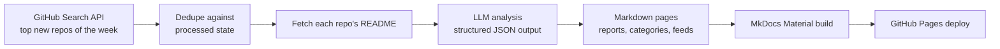

# 📡 Open Source Radar AI

**AI-curated radar of GitHub's hottest new repositories — analyzed, categorized, and published automatically every week.**

[](https://github.com/LokeshNanda/oss-radar-ai/actions/workflows/trending.yml)
[](LICENSE)
[](https://lokeshnanda.github.io/oss-radar-ai/)

👉 **Read this week's radar: [lokeshnanda.github.io/oss-radar-ai](https://lokeshnanda.github.io/oss-radar-ai/)**
📶 Subscribe: [RSS feed](https://lokeshnanda.github.io/oss-radar-ai/feed.xml) · Build on it: [JSON API](https://lokeshnanda.github.io/oss-radar-ai/api/latest.json)

Every Monday, this project finds the most-starred repositories created on GitHub in the last 7 days, generates an honest developer-focused breakdown of each one with an LLM (what it does, why it's interesting, how it works, how to try it, what to watch out for), and publishes everything as a static site — with zero manual steps.

---

## 📡 This week's radar

<!-- RADAR:START -->
_Week of 2026-07-24_

- [`andrewyng/openworker`](https://github.com/andrewyng/openworker) ([analysis](https://lokeshnanda.github.io/oss-radar-ai/repos/andrewyng--openworker/))
- [`lopopolo/harness-engineering`](https://github.com/lopopolo/harness-engineering) — 🐎 Ryan Lopopolo’s anthology, field guide, and agent context bundle for harness engineering ([analysis](https://lokeshnanda.github.io/oss-radar-ai/repos/lopopolo--harness-engineering/))
- [`MIgHTy-alIeN/MEV-Arbitrage-Bot`](https://github.com/MIgHTy-alIeN/MEV-Arbitrage-Bot) — An arbitrage bot is a smart contract connected to an external automation script that controls its operation. ([analysis](https://lokeshnanda.github.io/oss-radar-ai/repos/mighty-alien--mev-arbitrage-bot/))
- [`nyblnet/bento`](https://github.com/nyblnet/bento) ([analysis](https://lokeshnanda.github.io/oss-radar-ai/repos/nyblnet--bento/))
- [`Vincentwei1021/video-shotcraft`](https://github.com/Vincentwei1021/video-shotcraft) — AI video skill for Claude Code & Codex — cinematic product videos with Remotion: 106 shot recipe cards, 161 motion previews, a production-ready template ([analysis](https://lokeshnanda.github.io/oss-radar-ai/repos/vincentwei1021--video-shotcraft/))
- [`Jakubantalik/thinking-orbs`](https://github.com/Jakubantalik/thinking-orbs) — Dotted thought-orb loading indicators for AI & agent UIs — six tuned states, two sizes, auto dark/light ([analysis](https://lokeshnanda.github.io/oss-radar-ai/repos/jakubantalik--thinking-orbs/))
- [`Blaizzy/nativ`](https://github.com/Blaizzy/nativ) — Local AI, native to your Mac. Chat, serve, monitor, and connect MLX models from one macOS app. ([analysis](https://lokeshnanda.github.io/oss-radar-ai/repos/blaizzy--nativ/))
- [`powerycy/goutoujunshi`](https://github.com/powerycy/goutoujunshi) — 一个先接住情绪、再分析关系并给出可执行策略的 Codex 恋爱军师，内置心理、法律、社会、人文、哲学、婚姻家庭与性学知识库，支持多元关系。 ([analysis](https://lokeshnanda.github.io/oss-radar-ai/repos/powerycy--goutoujunshi/))
- [`pireel/pireel`](https://github.com/pireel/pireel) — Open-source, backend-free AI video editor for talking-head video — storyboarding, designed graphics, kinetic captions, themes and in-browser WebCodecs export. Drivable by any AI agent over MCP. ([analysis](https://lokeshnanda.github.io/oss-radar-ai/repos/pireel--pireel/))
<!-- RADAR:END -->

---

## ⚙️ How it works



Everything runs in a single scheduled GitHub Actions workflow ([`trending.yml`](.github/workflows/trending.yml)). Generated pages and state are committed back to the repo, so every run is reproducible and diffable.

## ✨ Features

- **Weekly radar reports** — the top 10 new repositories, ranked by stars
- **Developer-focused AI analysis** — grounded in each repo's README, honest about uncertainty, no hype
- **Deterministic & idempotent** — same inputs produce byte-identical output; repos are never analyzed twice
- **Fully automated** — fetch → analyze → publish with no human in the loop
- **Cheap to run** — roughly $0.05/week with `gpt-4o-mini`

## 🍴 Run your own radar

This project is designed to be forked. Point it at your favorite niche — a **Rust radar**, an **AI-agents radar**, a **security radar** — by changing a couple of environment variables, adding an API key, and enabling GitHub Pages. Follow the [10-minute setup guide](https://lokeshnanda.github.io/oss-radar-ai/run-your-own/).

## 🚀 Local development

```bash
python -m venv .venv
source .venv/bin/activate   # Windows: .venv\Scripts\activate
pip install -e ".[dev]"

# run the test suite
python -m pytest tests -q

# run the pipeline (needs OPENAI_API_KEY, optional GITHUB_TOKEN)
cp .env.example .env        # then fill in your keys
radar-run

# preview the site
mkdocs serve
```

### Configuration

| Variable | Default | Purpose |
| --- | --- | --- |
| `OPENAI_API_KEY` | — | Required. LLM API key |
| `OPENAI_MODEL` | `gpt-4o-mini` | Model used for analysis |
| `OPENAI_BASE_URL` | `https://api.openai.com` | Any OpenAI-compatible endpoint |
| `GITHUB_TOKEN` | — | Optional. Raises GitHub API rate limits |
| `GITHUB_PER_PAGE` | `10` | Repos fetched per run |
| `GITHUB_DAYS_BACK` | `7` | Lookback window in days |
| `RADAR_MAX_REPOS_PER_RUN` | `10` | Cap on repos analyzed per run |

## 🗺 Roadmap

See [ROADMAP.md](ROADMAP.md) and the [design spec](specs/2026-07-24-popularity-roadmap-design.md).

## 📄 License

[MIT](LICENSE)
