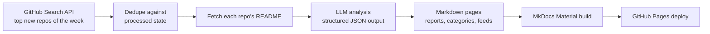

# 📡 Open Source Radar AI

**AI-curated radar of GitHub's hottest new repositories — analyzed, categorized, and published automatically every week.**

[](https://github.com/LokeshNanda/oss-radar-ai/actions/workflows/trending.yml)
[](LICENSE)
[](https://lokeshnanda.github.io/oss-radar-ai/)

👉 **Read this week's radar: [lokeshnanda.github.io/oss-radar-ai](https://lokeshnanda.github.io/oss-radar-ai/)**
📶 Subscribe: [RSS feed](https://lokeshnanda.github.io/oss-radar-ai/feed.xml) · Build on it: [JSON API](https://lokeshnanda.github.io/oss-radar-ai/api/latest.json)

Every Monday, this project finds the most-starred repositories created on GitHub in the last 7 days, generates an honest developer-focused breakdown of each one with an LLM (what it does, why it's interesting, how it works, how to try it, what to watch out for), and publishes everything as a static site — with zero manual steps.

---

## 📡 This week's radar

<!-- RADAR:START -->
_Week of 2026-08-24_

- [`s1dashu/ip-as-logo-skill`](https://github.com/s1dashu/ip-as-logo-skill) — A compact Agent Skill for highly simplified, rounded, subtly neo-skeuomorphic IP mascot logos. ([analysis](https://lokeshnanda.github.io/oss-radar-ai/repos/s1dashu--ip-as-logo-skill/))
- [`MengTo/threeui`](https://github.com/MengTo/threeui) — Open-source ThreeUI Community catalog with live interactive components and complete Community source. ([analysis](https://lokeshnanda.github.io/oss-radar-ai/repos/mengto--threeui/))
- [`yetone/cumora`](https://github.com/yetone/cumora) — Where agent teams gather. Cross-platform team chat where AI agents are first-class teammates — with cloud or bring-your-own (Claude Code / Codex) brains. ([analysis](https://lokeshnanda.github.io/oss-radar-ai/repos/yetone--cumora/))
- [`CopilotKit/OpenBot`](https://github.com/CopilotKit/OpenBot) — Open-source AI coworkers that each get a computer of their own: a browser, files and tools, with every action decided before it happens and recorded after. Bring any AG-UI agent. ([analysis](https://lokeshnanda.github.io/oss-radar-ai/repos/copilotkit--openbot/))
- [`wang2122/sprix-sage-router`](https://github.com/wang2122/sprix-sage-router) — Sprix AI at 屿智同行 — state-aware SELF/COLLABORATE/HANDOFF routing for A2A agent networks. ([analysis](https://lokeshnanda.github.io/oss-radar-ai/repos/wang2122--sprix-sage-router/))
- [`vvxw/deploy-vercel`](https://github.com/vvxw/deploy-vercel) — Install Command：npm install ([analysis](https://lokeshnanda.github.io/oss-radar-ai/repos/vvxw--deploy-vercel/))
- [`cinderline/northcinder`](https://github.com/cinderline/northcinder) — Open-source MCP server for comparing products and asking the buyer before purchase. ([analysis](https://lokeshnanda.github.io/oss-radar-ai/repos/cinderline--northcinder/))
- [`b-nnett/grok-bot-0.18-reconstructed`](https://github.com/b-nnett/grok-bot-0.18-reconstructed) — Unofficial source-oriented reconstruction and extension of Grok Bot 0.18.0 for macOS ([analysis](https://lokeshnanda.github.io/oss-radar-ai/repos/b-nnett--grok-bot-0-18-reconstructed/))
- [`duty1g/x64dbg-mcp-server`](https://github.com/duty1g/x64dbg-mcp-server) — x64dbg-MCP Server is a native MCP (Model Context Protocol) plugin for x64dbg that exposes the debugger's full functionality over HTTP. Connect any MCP-compatible AI assistant and control x64dbg programmatically: set breakpoints, step through code, read memory, dump registers, and more.  Built with Zig — zero dependencies, single-binary output, cros ([analysis](https://lokeshnanda.github.io/oss-radar-ai/repos/duty1g--x64dbg-mcp-server/))
- [`MeteorNOX/DeepSeek-Balance-Whale-Widget`](https://github.com/MeteorNOX/DeepSeek-Balance-Whale-Widget) — DeepSeek Harness（DSH）一只住在 DSH 界面右下角的小鲸鱼娘，帮你盯着DeepSeek账户余额。QQ弹弹，支持拖拽吸附、左吸附翻转、数字滚动动画，随界面自动启用，建议直接喊来你的dsh安装 ([analysis](https://lokeshnanda.github.io/oss-radar-ai/repos/meteornox--deepseek-balance-whale-widget/))
<!-- RADAR:END -->

---

## ⚙️ How it works



Everything runs in a single scheduled GitHub Actions workflow. Generated pages and state are committed back to the repo, so every run is reproducible and diffable.

## ✨ Features

- **Weekly radar reports** — the top 10 new repositories, ranked by stars
- **Developer-focused AI analysis** — grounded in each repo's README, honest about uncertainty, no hype
- **Deterministic & idempotent** — same inputs produce byte-identical output; repos are never analyzed twice
- **Fully automated** — fetch → analyze → publish with no human in the loop
- **Cheap to run** — roughly $0.05/week with `gpt-4o-mini`

## 🍴 Run your own radar

This project is designed to be forked. Point it at your favorite niche — a **Rust radar**, an **AI-agents radar**, a **security radar** — by changing a couple of environment variables, adding an API key, and enabling GitHub Pages. Follow the [10-minute setup guide](https://lokeshnanda.github.io/oss-radar-ai/run-your-own/).

## 🚀 Local development

```bash
python -m venv .venv
source .venv/bin/activate   # Windows: .venv\Scripts\activate
pip install -e ".[dev]"

# run the test suite
python -m pytest tests -q

# run the pipeline (needs OPENAI_API_KEY, optional GITHUB_TOKEN)
cp .env.example .env        # then fill in your keys
radar-run

# preview the site
mkdocs serve
```

### Configuration

| Variable                  | Default                  | Purpose                                                                   |
| ------------------------- | ------------------------ | ------------------------------------------------------------------------- |
| `OPENAI_API_KEY`          | —                        | Required. LLM API key                                                     |
| `OPENAI_MODEL`            | `gpt-4o-mini`            | Model used for analysis                                                   |
| `OPENAI_BASE_URL`         | `https://api.openai.com` | Any OpenAI-compatible endpoint                                            |
| `GITHUB_TOKEN`            | —                        | Optional. Raises GitHub API rate limits                                   |
| `GITHUB_PER_PAGE`         | `10`                     | Repos fetched per run                                                     |
| `GITHUB_DAYS_BACK`        | `7`                      | Lookback window in days                                                   |
| `RADAR_MAX_REPOS_PER_RUN` | `10`                     | Cap on repos analyzed per run                                             |
| `RADAR_BLOCKLIST_TERMS`   | —                        | Extra comma-separated terms added to the built-in cheat/malware blocklist |
| `RADAR_BLOCKED_REPOS`     | —                        | Comma-separated `owner/name` repos to never feature                       |

## 🗺 Roadmap

See [ROADMAP.md](ROADMAP.md) and the [design spec](specs/2026-07-24-popularity-roadmap-design.md).

## 📄 License

[MIT](LICENSE)
